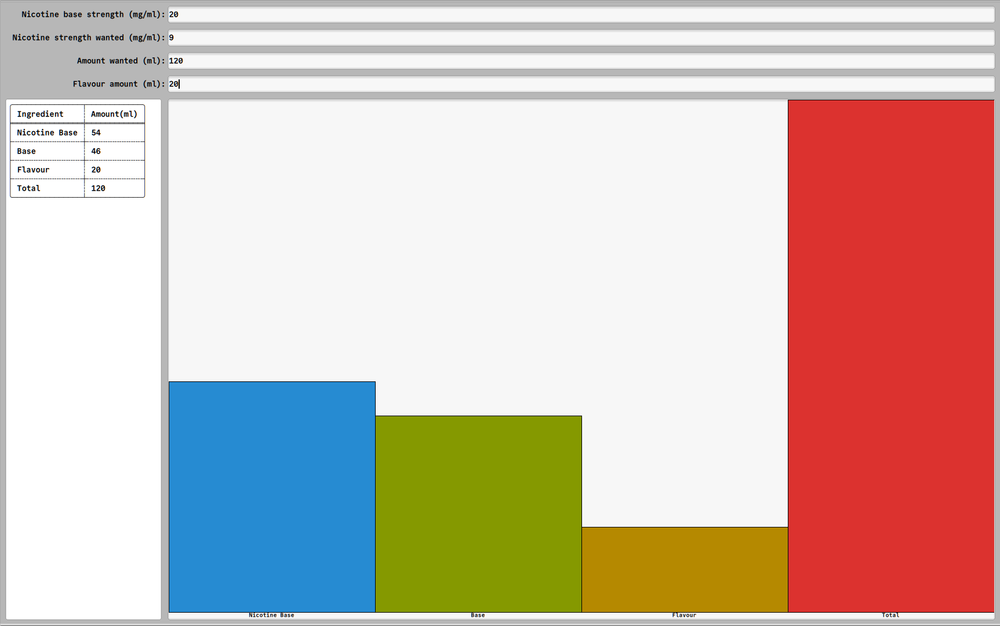

# Niccalc


Niccalc is a tool that helps to determine the necessary amount of nicotine for an e-cigarette liquid,
all you have to do is enter the corresponding values in the input fields.
The amount of flavor is optional.

This software is written in Rust using the Rust bindings for the FLTK Graphical User Interface library [fltk-rs](https://crates.io/crates/fltk)
and [comfy-table](https://crates.io/crates/comfy-table).



## Installation

### Linux and other

First install cargo.

Now, compile the niccalc-crate:

```
cargo install niccalc
```
